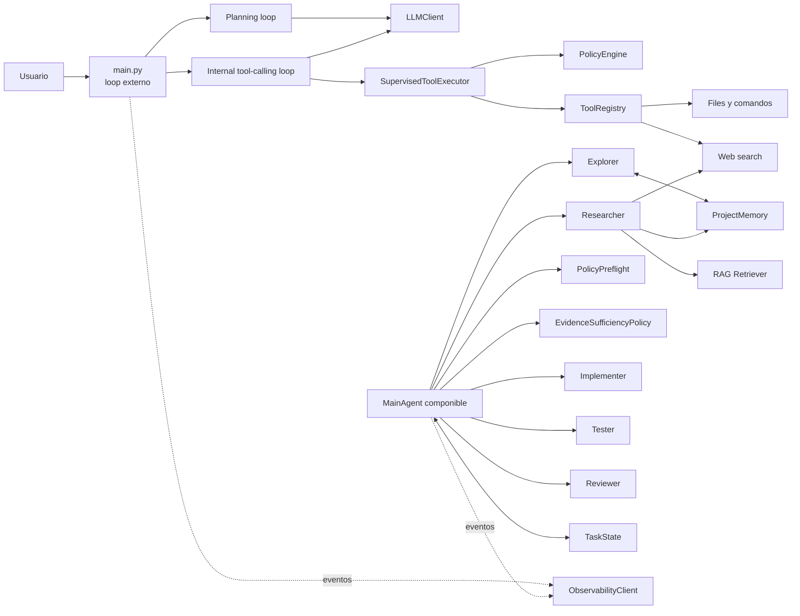
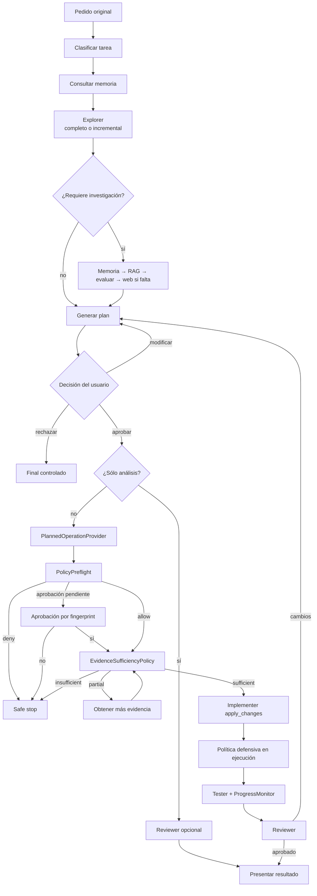

# Coding Agent

Coding agent educativo implementado en Python sin frameworks de orquestación como
LangChain, LangGraph, CrewAI o AutoGen. El proyecto conecta un LLM con herramientas
locales mediante tool calling, conserva el historial de chat y aplica planificación,
supervisión, políticas, evidencia, memoria, RAG y observabilidad mediante contratos
propios e inyección de dependencias.

El entry point público actual, `python main.py`, implementa los dos loops obligatorios:

1. un loop externo de chat que conserva el historial entre mensajes;
2. un loop interno que llama al LLM, ejecuta tool calls y repite hasta obtener una
   respuesta final o alcanzar el límite de iteraciones.

La arquitectura multiagente (`MainAgent`, Explorer, Researcher, Implementer, Tester
y Reviewer) está implementada como una capa componible y cubierta por escenarios
integrales deterministas. Todavía no reemplaza al bootstrap interactivo de `main.py`.

## Caso de uso: PrintScript

El caso de evaluación es **analizar un repositorio real y desconocido para el
agente**: un checkout externo de PrintScript (Kotlin, build con Gradle: lexer,
parser, interpreter, formatter, linter, runner, cli), usado como workspace
autorizado fuera de este repositorio. Corresponde al objetivo "Analizar un
repositorio desconocido" de la consigna. El agente se usa para:

- relevar módulos, estructura, convenciones y dependencias del repositorio;
- consultar documentación técnica indexada mediante RAG —tanto la especificación
  del lenguaje PrintScript como documentación oficial de Kotlin, su lenguaje de
  implementación— para fundamentar sus conclusiones;
- generar un reporte de arquitectura citando qué es hallazgo del repositorio,
  qué viene del RAG y qué es inferencia propia.

Deliberadamente **no** incluye modificar código ni ejecutar builds/tests de
PrintScript: es un caso de uso de sólo análisis, más simple y menos dependiente
de que el entorno de Gradle/Kotlin esté perfectamente configurado en la máquina
de evaluación. Implementer, Tester y Reviewer siguen implementados y cubiertos
por los escenarios de `tests/integration/`, pero no forman parte de este caso de
uso concreto.

### Objetivo concreto y criterio de éxito

Pedirle al agente que explique la arquitectura de PrintScript y la
responsabilidad de cada módulo (`lexer`, `parser`, `interpreter`, `formatter`,
`linter`, `runner`, `cli`, `common`), citando tanto la especificación del
lenguaje (cátedra) como documentación de Kotlin, ambas indexadas por RAG.

*Criterio de éxito*: el resultado debe citar al menos una fuente RAG concreta de
cada una (no inferencia) y quedar registrado como evidencia reproducible (output
+ trazabilidad de fuentes + traza en Langfuse).

### Estado real de la incorporación (no HTML de marketing, estado verificado)

- `agent.config.yaml` (no versionado, local) apunta el workspace a un checkout externo
  de PrintScript, en modo sólo lectura (`write: false`, `run_commands: false`).
- `profiles/printscript.yaml` describe el proyecto y declara como fuentes RAG la
  especificación del lenguaje (cátedra) y tres páginas oficiales de la documentación
  de Kotlin, descargadas en vivo (no el README del checkout, que no tenía contenido
  sustancial).
- El índice RAG ya fue construido con esas fuentes reales (68 chunks, verificado;
  incluye un `HtmlDocumentParser` propio para extraer texto limpio de las páginas
  de Kotlin sin ruido de HTML).
- Existe un script de composición (`run_agent.py`) que arma `MainAgent` con Explorer
  y Researcher reales desde `agent.config.yaml` — validado end-to-end contra la API
  real de OpenAI (llegó a llamarla; falló sólo por cuota agotada de la cuenta usada
  para probar, no por un error del código). Es todo lo que este caso de uso necesita:
  no se conectan Implementer/Tester/Reviewer.

## Requisitos

- Python 3.10 o superior.
- `pip` y soporte para entornos virtuales.
- Para el chat real: `OPENAI_API_KEY` y `OPENAI_MODEL`.
- Para búsqueda web real: `TAVILY_API_KEY`.
- Para Langfuse real, opcional: credenciales de Langfuse.

Los tests usan clientes falsos y no requieren red, credenciales ni proveedores
externos.

## Instalación

```bash
python3.10 -m venv .venv
source .venv/bin/activate
python -m pip install -e ".[dev]"
```

En Windows PowerShell, la activación equivalente es:

```powershell
.venv\Scripts\Activate.ps1
```

También existe un archivo de dependencias compatible:

```bash
python -m pip install -r requirements.txt
```

## Configuración

La sesión combina tres fuentes:

1. variables de entorno para credenciales y selección de proveedores;
2. `agent.config.yaml` para workspace, permisos, límites, RAG, memoria y web;
3. un `ProjectProfile` opcional como base reutilizable, sobre el cual la configuración
   explícita del usuario tiene prioridad.

Para partir del ejemplo:

```bash
cp agent.config.example.yaml agent.config.yaml
cp .env.example .env
```

No se deben versionar secretos. El código y los eventos de observabilidad aplican
sanitización recursiva, pero eso no reemplaza una gestión segura de credenciales.

## Variables de entorno

| Variable | Uso | Obligatoria |
|---|---|---|
| `OPENAI_API_KEY` | Autenticación del cliente LLM | Para `python main.py` |
| `OPENAI_MODEL` | Modelo enviado a la Responses API | Para `python main.py` |
| `TAVILY_API_KEY` | Búsqueda web mediante Tavily | Sólo si se usa web real |
| `CODING_AGENT_CONFIG` | Ruta alternativa a `agent.config.yaml` | No |
| `CODING_AGENT_WEB_SEARCH_ENABLED` | Activa/desactiva web (`true`/`false` y equivalentes) | No |
| `CODING_AGENT_WEB_SEARCH_CONFIG` | Configuración web adicional como objeto JSON | No |
| `CODING_AGENT_OBSERVABILITY_ENABLED` | Habilita la factory de observabilidad | No; default `false` |
| `LANGFUSE_PUBLIC_KEY` | Credencial pública de Langfuse | Sólo con observabilidad real |
| `LANGFUSE_SECRET_KEY` | Credencial secreta de Langfuse | Sólo con observabilidad real |
| `LANGFUSE_HOST` | Host alternativo de Langfuse | No |

Si observabilidad está deshabilitada, faltan credenciales o falla el proveedor, la
factory utiliza `NoOpObservabilityClient` y la tarea principal continúa.

## `agent.config.yaml`

El loader es estricto: rechaza YAML inválido, campos desconocidos, rutas locales que
escapen del workspace y combinaciones incoherentes. Un ejemplo funcional de esquema
es:

```yaml
workspace:
  path: workspace
  ignore:
    - .git/**
    - .cache/**

permissions:
  read: true
  write: false
  run_commands: false
  web_search: false

commands: {}

limits:
  max_iterations: 20
  context_chars: 8000
  command_timeout_seconds: 60
  max_rag_results: 5
  max_web_results: 5

rag:
  enabled: false
  index_path: .coding-agent/rag/index.json
  sources: []

memory:
  enabled: true
  path: .coding-agent/memory
  identifier: null

observability:
  enabled: true
  log_level: INFO
  trace_tools: true

web_search:
  enabled: false
  allowed_domains: []
  priority_domains: []
  blocked_domains: []
  max_results: 5
  technology_domains: {}
```

Para heredar un perfil se agrega, en la raíz:

```yaml
profile: profiles/example-generic.yaml
```

El repositorio incluye solamente `profiles/default.yaml` y un ejemplo genérico. Los
valores explícitos de `agent.config.yaml` reemplazan escalares y listas heredadas;
los diccionarios se combinan recursivamente. Una lista vacía explícita elimina la
lista heredada. El perfil orienta a los agentes, pero tecnologías esperadas nunca se
presentan como detectadas sin evidencia del repositorio.

Actualmente las file tools del entry point público están confinadas al directorio
`workspace/`. Para la CLI conviene mantener `workspace.path: workspace`; la
composición avanzada permite inyectar otras raíces confinadas.

## Indexación RAG

El indexador usa un manifiesto JSON independiente. Ejemplo:

```json
{
  "index_path": ".coding-agent/rag/index.json",
  "sources": [
    {
      "name": "project-docs",
      "loader": "local",
      "source_type": "documentation",
      "path": "docs",
      "parser": "sections",
      "patterns": ["**/*.md"],
      "tags": ["project"]
    }
  ],
  "chunking": {
    "max_characters": 1500,
    "overlap_characters": 150,
    "respect_sections": true
  },
  "embedding": {
    "provider": "hash",
    "dimensions": 128
  }
}
```

El indexador se ejecuta como módulo:

```bash
python -m rag.cli path/to/manifest.json
```

Para eliminar del índice documentos que ya no aparecen en el manifiesto:

```bash
python -m rag.cli path/to/manifest.json --prune
```

Las fuentes locales relativas se resuelven respecto del manifiesto. Los loaders URL
realizan acceso de red y sólo deben usarse cuando fueron configurados explícitamente.

## Ejecución del agente

```bash
python main.py
```

Comandos del chat:

- `/status`: muestra Plan mode, Supervision mode y límites activos;
- `/plan on` y `/plan off`: activan o desactivan planificación previa;
- `/supervision on` y `/supervision off`: controlan confirmación de tools mutadoras;
- `/exit`: finaliza el chat.

Los mensajes vacíos se ignoran. `Ctrl+C` y EOF finalizan de forma controlada.

## Aprobación, rechazo y modificación de planes

Con Plan mode activo, el LLM recibe el historial pero no schemas de tools. Después
de mostrar el plan, la CLI solicita:

- `a` o `aprobar`: aprueba el plan y habilita la fase de ejecución;
- `r` o `rechazar`: cancela el pedido sin ejecutar tools;
- `m` o `modificar`: solicita una instrucción de cambio y genera un plan completo
  nuevo.

Un plan vacío, una tool call durante planificación o agotar las revisiones produce
un error controlado. Aprobar el plan no evita las políticas ni las confirmaciones
individuales posteriores.

## Arquitectura general



Responsabilidades principales:

- `main.py`: composición pública, comandos interactivos e historial de sesión.
- `core/harness.py`: loops de planificación y tool calling.
- `core/llm_client.py`: contrato LLM, adaptador OpenAI, tokens y latencia.
- `tools/`: schemas, validación y ejecución de tools.
- `security/`: políticas de rutas, comandos, evidencia y autorización.
- `core/planned_operations.py`: intención estructurada y preflight anticipado.
- `agents/`: orquestador y agentes especializados.
- `rag/`: ingesta, chunking, embeddings, índice y recuperación.

## Flujo completo de una tarea multiagente



## Agente principal

`MainAgent` coordina fases mediante Python normal. Crea `TaskState`, selecciona
agentes, conserva el plan aprobado, ejecuta preflight antes de evidencia y escritura,
interpreta resultados de Tester/Reviewer, limita iteraciones y presenta bloqueos
estructurados. La opción `review_analysis_tasks` permite revisar análisis sin
habilitar Implementer ni escritura.

## Subagentes

- **Explorer:** inventaría el workspace, detecta estructura y tecnologías con
  evidencia, prioriza archivos del perfil y realiza exploración incremental cuando
  hay fingerprints vigentes.
- **Researcher:** consulta en orden memoria → RAG → evaluación de suficiencia → web
  como fallback; conserva fuentes y separa hechos de inferencias.
- **Implementer:** selecciona fragmentos, propone reemplazos exactos y sólo aplica
  cambios con plan y `EvidenceAssessment` sufficient vigentes.
- **Tester:** selecciona comandos respaldados, aplica `PolicyEngine`, ejecuta con
  límites y registra resultados normalizados y progreso.
- **Reviewer:** revisa evidencia, diff, validaciones, alcance y riesgos; puede aprobar,
  pedir cambios, bloquear o indicar evidencia insuficiente.

Todos reciben dependencias explícitas. Los tests pueden inyectar LLM, memoria, RAG,
web, command runners, aprobación y observabilidad falsos.

## Estado compartido

`TaskState` registra de forma serializable:

- pedido, estado y fase;
- plan propuesto y aprobado;
- resultados de subagentes y fuentes;
- hallazgos, archivos leídos/modificados y comandos;
- tool calls, errores, advertencias y observaciones;
- `EvidenceAssessment` ligado a la versión vigente del plan;
- operaciones planificadas, decisiones de preflight y fingerprints aprobados;
- resultado final.

Cambiar el plan invalida la evaluación de evidencia. Una aprobación de preflight se
asocia al fingerprint exacto de tipo, target, parámetros, versión del plan y origen.

## Memoria persistente

`ProjectMemory` almacena JSON por workspace usando reemplazo atómico y permisos de
archivo restrictivos. Conserva arquitectura, tecnologías, módulos, archivos
importantes, dependencias, comandos, convenciones, decisiones, bugs, tareas previas,
resúmenes y fingerprints de exploración.

La memoria es una pista, no una verdad actual. Explorer compara tamaño y `mtime_ns`,
revalida una muestra estable, inspecciona archivos nuevos o modificados y vuelve a
exploración completa ante ausencia o corrupción. El identificador configurado se
combina con un hash del workspace para mantener aislamiento.

## RAG

### Fuentes

`ConfiguredSourceLoader` admite fuentes `local` y `url` declaradas. Los directorios
locales requieren `patterns`; no se descubren fuentes implícitamente.

### Chunking

`SectionDocumentParser` reconoce encabezados Markdown. `WhitespaceNormalizer`
normaliza espacios preservando párrafos. `ConfigurableChunker` permite longitud
máxima, solapamiento y respeto por secciones.

### Embeddings

La instalación incluye `HashEmbeddingProvider`, local y determinista. Produce
vectores normalizados y sirve para pruebas y funcionamiento sin proveedor externo;
no equivale semánticamente a un modelo de embeddings entrenado.

### Almacenamiento y recuperación

`JsonVectorStore` persiste documentos, hashes, chunks, embeddings y metadata en un
JSON versionado mediante reemplazo atómico. El indexador evita reindexar contenido
sin cambios, deduplica chunks y puede podar documentos. El retriever devuelve
identificadores, scores, documentos y trazabilidad de chunks recuperados/utilizados.

## Políticas de seguridad

- Las tools locales están confinadas al workspace.
- Se rechazan escapes `..`, rutas absolutas externas, symlinks de escape y archivos
  sensibles como `.env`.
- `run_command` usa `shell=False`, cwd confinado y timeout.
- Se bloquean comandos destructivos conocidos, wrappers, `git push`,
  `git reset --hard`, evaluación inline y argumentos con rutas externas.
- Plan mode y Supervision mode agregan aprobación humana, pero no relajan políticas.
- `PolicyPreflight` evalúa operaciones estructuradas antes de `apply_changes`.
- Las políticas se vuelven a aplicar al ejecutar tools o comandos.
- Los perfiles pueden agregar restricciones, nunca relajar reglas base.
- Los secretos se sanitizan antes de observabilidad.

Estas defensas no constituyen un sandbox fuerte del sistema operativo. Ejecutar
código no confiable requiere aislamiento externo adicional.

## Detección de loops y falta de progreso

`ProgressMonitor` normaliza acciones y detecta:

- mismo comando con el mismo error;
- lecturas, búsquedas o modificaciones repetidas;
- diffs idénticos;
- ciclos entre agentes;
- iteraciones sin evidencia nueva.

Devuelve recomendaciones estructuradas: `retry_with_new_strategy`, `replan`,
`ask_user` o `stop`. Los límites son configurables y el orquestador además aplica
`max_iterations`, por lo que no reintenta indefinidamente.

## Suficiencia de evidencia

Antes de escribir, `EvidenceSufficiencyPolicy` considera componente, comportamiento
esperado, convenciones, impacto, archivos objetivo existentes, fuentes, validaciones,
permisos, contradicciones y riesgos.

- `sufficient`: permite continuar.
- `partial`: solicita Explorer/Researcher adicional y no escribe todavía.
- `insufficient`: bloquea y devuelve faltantes, riesgos, acción y confianza.

Ambigüedad, archivos inexistentes, contradicciones, permisos insuficientes, ausencia
de validación o riesgo excesivo impiden presentar la evidencia como suficiente.
Además, una tarea de modificación necesita operaciones estructuradas; el texto libre
del plan no se convierte en acciones mediante heurísticas.

## Observabilidad

`ObservabilityClient` desacopla el núcleo del proveedor. Hay implementaciones
No-Op y Langfuse; los fakes permiten verificar jerarquías sin red. La instrumentación
registra, cuando están disponibles, tarea, agentes, prompts, modelo, llamadas LLM,
tools, memoria, RAG, web, políticas, evidencia, progreso, errores, latencia, tokens y
resultado.

Los eventos forman una jerarquía lógica con una observación raíz por tarea y eventos
hijos por agente/componente. La sanitización es central y recursiva. Los errores del
proveedor no interrumpen la tarea. `estimated_cost` permanece `None` si no existe una
tabla explícita de precios; el sistema no inventa costos.

## Tests

Suite completa:

```bash
python -m pytest -q
```

Sólo escenarios integrales:

```bash
python -m pytest tests/integration -q
```

Los tests no utilizan OpenAI, Tavily, Langfuse ni red reales. Cubren loops, tools,
configuración, perfiles, subagentes, memoria, RAG, políticas, evidencia,
observabilidad y escenarios completos con repositorios temporales.

## Reproducir los escenarios de evidencia

Cada escenario crea un repositorio aislado mediante `tmp_path` y usa fakes
deterministas:

```bash
python -m pytest tests/integration/test_analysis_scenario.py -q
python -m pytest tests/integration/test_simple_change_scenario.py -q
python -m pytest tests/integration/test_rag_scenario.py -q
python -m pytest tests/integration/test_memory_scenario.py -q
python -m pytest tests/integration/test_failed_command_scenario.py -q
python -m pytest tests/integration/test_blocked_operation_scenario.py -q
```

Los escenarios demuestran análisis sin escritura, cambio localizado, RAG sin web,
recarga real de memoria, comando fallido con detección de progreso y safe stop por
preflight. Las aserciones de los tests son la evidencia reproducible; este README no
declara resultados de una corrida externa no ejecutada.

## Limitaciones conocidas

- La CLI pública todavía utiliza el harness directo y no compone automáticamente
  `MainAgent` ni los subagentes avanzados.
- Para la CLI pública, las file tools concretas siguen usando `workspace/`; un
  workspace alternativo requiere una composición explícita coherente.
- `HashEmbeddingProvider` es determinista pero no ofrece embeddings semánticos de la
  calidad de un modelo entrenado.
- El índice JSON es auditable y adecuado para el TP, no para grandes volúmenes ni
  concurrencia distribuida.
- La exploración incremental usa tamaño y `mtime_ns`; cambios que preserven ambos
  metadatos podrían requerir una exploración completa manual.
- El preflight sólo crea operaciones desde intención estructurada. No interpreta
  menciones en texto libre como acciones.
- La política de comandos reduce riesgos conocidos, pero no puede determinar el
  comportamiento interno de cualquier ejecutable permitido.
- La búsqueda web y las fuentes RAG URL requieren red y credenciales/configuración
  externas; su disponibilidad no está garantizada.
- No se incluye una corrida ni un perfil específico de PrintScript.
